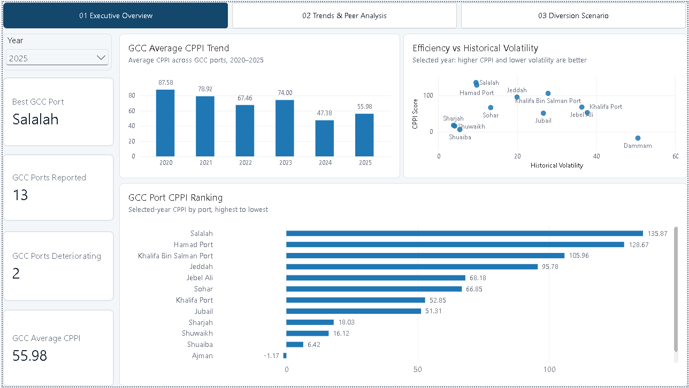
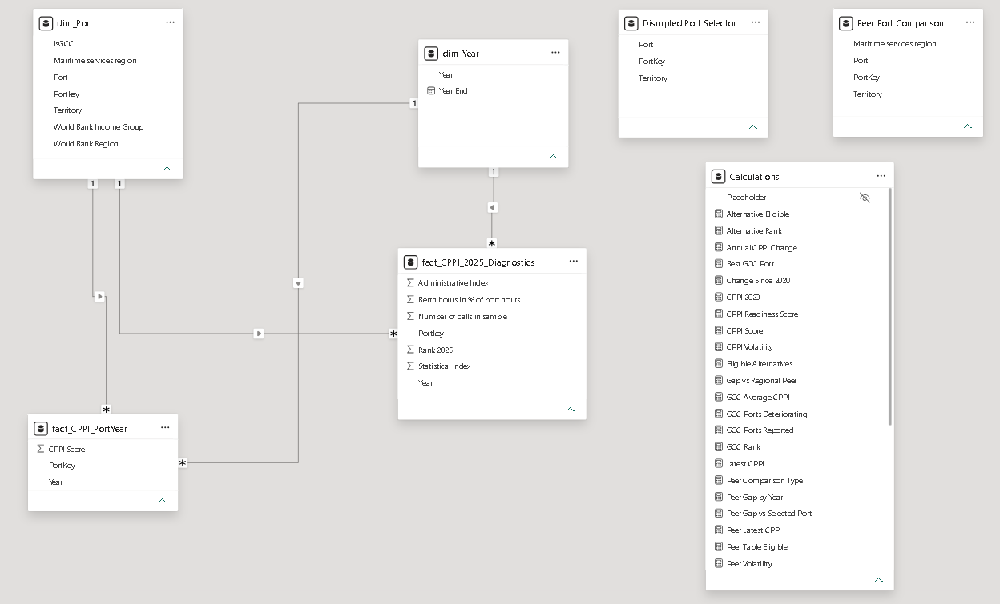
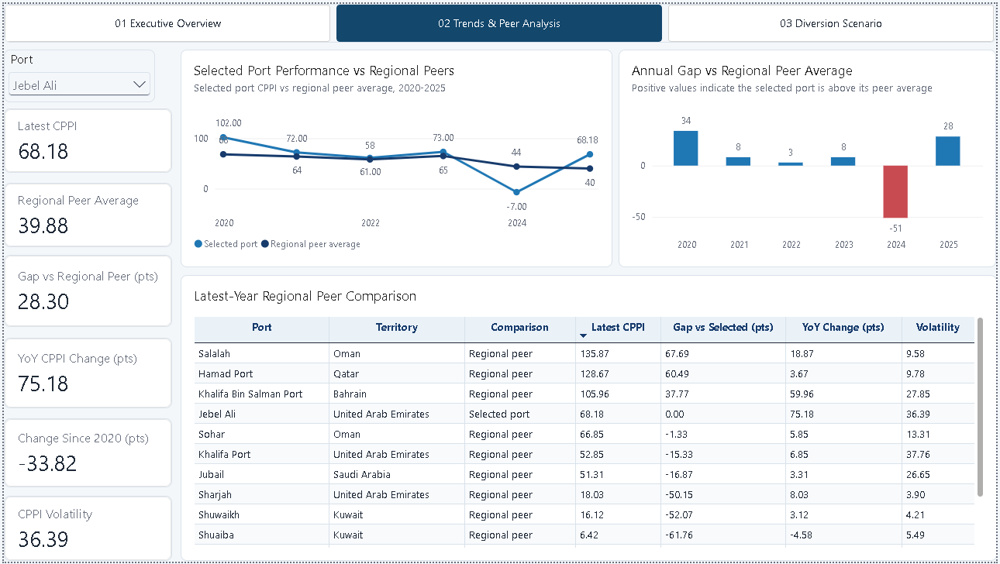
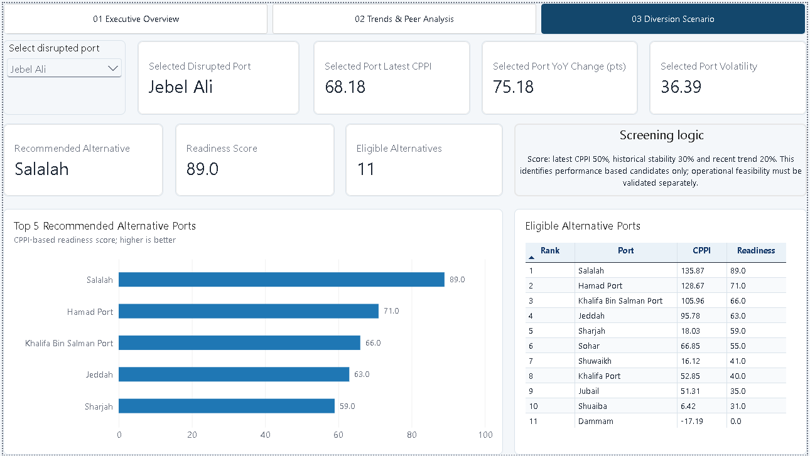
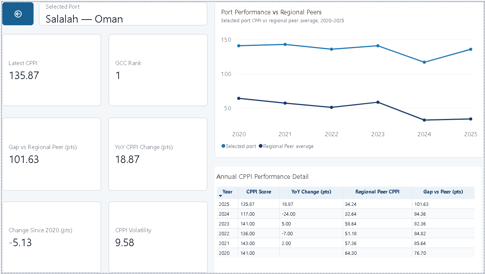

# GCC Port Efficiency & Diversion Readiness Dashboard

Power BI portfolio case study based on the World Bank Container Port Performance Index (CPPI) 2020-2025 dataset.



## Project overview

This project uses a realistic logistics disruption scenario: a regional importer needs to monitor GCC port efficiency, identify deteriorating gateways and screen alternative ports when a primary gateway is disrupted.

I built an interactive Power BI report that combines regional monitoring, selected port diagnostics, peer comparison and a weighted diversion readiness screen. The business scenario is illustrative; the underlying CPPI data are real and publicly available.

## Business questions

- How has average GCC port performance changed since 2020?
- Which ports are improving or deteriorating in the selected year?
- How does a selected port compare with other ports in its maritime services region?
- Which GCC ports should be reviewed first as possible alternatives during a disruption?
- What evidence sits behind an alternative port recommendation?

## Data source and scope

- **Source:** World Bank Group and S&P Global Market Intelligence, CPPI 2025 Annex
- **Period:** 2020-2025
- **Raw dataset:** 426 port records and 20 fields
- **Portfolio scope:** Bahrain, Kuwait, Oman, Qatar, Saudi Arabia and the United Arab Emirates
- **2025 coverage:** 13 GCC ports with a reported CPPI score

The CPPI benchmarks port efficiency using vessel time in port. It should be interpreted as a diagnostic indicator rather than a complete measure of operational feasibility.

## Solution design

### Data preparation

- Reshaped the wide annual CPPI columns into a port year fact table in Power Query.
- Retained the 2025 statistical and administrative index fields in a separate diagnostic fact table.
- Created reusable port and year dimensions with one to many, single direction relationships.
- Added disconnected selector tables for disruption scenarios and peer comparison logic.
- Centralised report measures in a dedicated `Calculations` table.



### Core measures

- Latest/selected year CPPI
- GCC average CPPI and selected year ranking
- Year on year CPPI change in points
- Change since 2020 in points
- Six year CPPI volatility using sample standard deviation
- Regional peer average excluding the selected port
- Gap versus regional peers
- Alternative eligibility, rank and weighted readiness score

The readiness score weights latest CPPI at 50%, historical stability at 30% and recent trend at 20%. It is designed to shortlist candidates for further review, not to make the final diversion decision.

## Report pages

### 1. Executive Overview

Tracks the regional trend, current year ranking, deterioration count and the relationship between current performance and historical volatility.


### 2. Trends & Peer Analysis

Compares a selected port with its maritime services region peer average, shows the annual performance gap and provides a latest-year peer table.



### 3. Diversion Scenario

Uses a disconnected port selector and weighted readiness measures to rank data eligible alternatives while excluding the disrupted port.



### 4. Port Drillthrough

Provides annual evidence behind a selected port, including GCC rank, peer gap, year on year change, longer term change and volatility.



## Key findings

- The GCC average CPPI increased from **47.38 in 2024 to 55.98 in 2025**, but remained **31.61 points below 2020**.
- **Salalah ranked first** among the GCC ports in scope with a 2025 CPPI score of **135.87**.
- **Dammam and Shuaiba deteriorated** year on year in 2025.
- Jebel Ali rebounded by **75.18 points** in 2025 and sat **28.30 points above** its regional peer average, but remained **33.82 points below 2020** and recorded high volatility of **36.39**.
- For the Jebel Ali disruption scenario, **Salalah ranked first with a readiness score of 89.0**, followed by Hamad Port and Khalifa Bin Salman Port.

## Business interpretation

Jebel Ali's 2025 recovery is material, but the six year pattern is still volatile. The diversion screen therefore considers both current performance and stability. Salalah is the strongest performance based candidate, but it would still require operational validation for capacity, route distance, cargo compatibility, customs, inland transport and total cost.

## Validation performed

- Reconciled the 2025 GCC average across the 13 ports with a current score.
- Spot-checked year on year changes, changes since 2020, peer gaps and volatility.
- Tested year and port slicers, selected port exclusion, sorting, drillthrough context and back button navigation.
- Standardised titles, units, number precision, table styling, colours and navigation across pages.

## Limitations

- CPPI is a port level benchmark and does not explain the cause of performance differences.
- Scores can be affected by external shipping, weather, labour and geopolitical conditions.
- Historical averages use available observations; some ports do not have a complete 2020-2025 series.
- The readiness model does not include live capacity, sailing distance, service frequency, cargo constraints or cost.

## Repository structure

```text
01_Business_Brief/
02_Data/
03_PowerBI/
04_Documentation/
05_Exports/
```

## Tools and techniques

**Power BI Desktop | Power Query | DAX | Star schema | Disconnected slicers | Dynamic ranking | Peer analysis | Drillthrough | Data validation | Dashboard design**

## Sources

- [World Bank - The Container Port Performance Index 2025](https://www.worldbank.org/en/topic/transport/publication/cppi)
- [World Bank Open Knowledge Repository - CPPI 2025](https://openknowledge.worldbank.org/entities/publication/fd314120-c813-4377-8780-178aca5dfa1b)
- [CPPI Methodology Note - June 10, 2026](https://thedocs.worldbank.org/en/doc/aac122f6df85534428d66a7b9af4b7f6-0400012026/original/CPPI-Methodology-Note.pdf)
